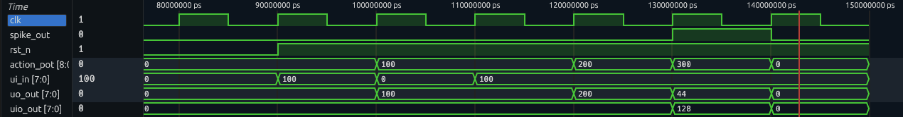

<!---

This file is used to generate your project datasheet. Please fill in the information below and delete any unused
sections.

You can also include images in this folder and reference them in the markdown. Each image must be less than
512 kb in size, and the combined size of all images must be less than 1 MB.
-->

## How it works

This code implements an integrate-and-fire neuron. It takes an 8-bit input (ui_in[7:0]), which is accumulated onto an action potential. The action potential is implemented using 9 bits internally to handle overflows. The module outputs the 8 LSB bits (uo_out[7:0])of this action potential and an output spike (uio_out[7]) whenever the action potential exceeds 250.

The waveforms in the image demonstrate the working of this neuron. rst_n is initially pulled down to drive the circuit to a known state (action potential is set to 0). rst_n is then pulled up and an input (of decimal value 100 through ui_in[7:0] here) is sent to the neuron. It can be seen that the action potential updates from 0 to 100 with a delay of one clock period. The input is then changed to 0. The action potential remains at 100, as expected (100+0). Then, the input is raised to 100 again. The action potential is updated to 200 (100+100), then to 300 (200+100). Note that since uo_out consists of only 8 LSBs of the actual action potential, it reflects 44 when the actual action potential is 300. Since 300>250 (our internally defined threshold), an output spike is then sent (which corresponds to a decimal value of 128 for uio_out) and the action potential is reset back to 0. This behaviour is consistent with our expectation from an integrate-and-fire neuron.

Note, if the internal action potential too was stored in an 8-bit register, 200+100 would have overflown to 44. This would have made the neuron miss the threshold-crossing event and no output spike would have been sent.

## How to test

Make rst_n low to drive the circuit to a known state initially. Make rst_n high again. Give a clock (clk) and some input voltage (ui_in). Keep track of the actual and expected action potential (uo_out) and the output spikes (uio_out[7]).
